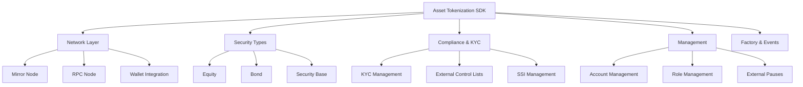
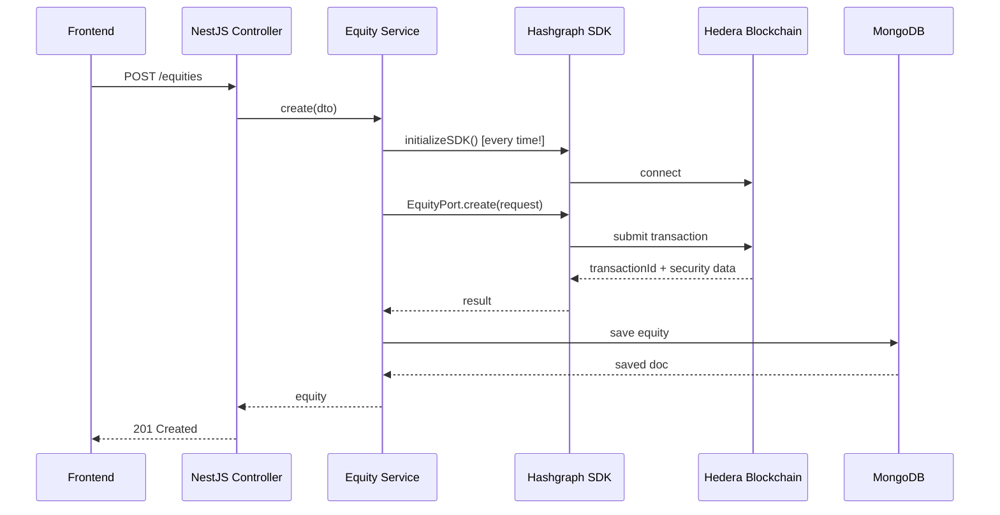
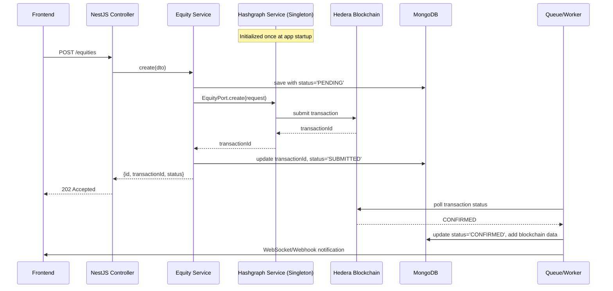

# Hashgraph Asset Tokenization SDK - Implementation Analysis

## Executive Summary

The NBX Backend integrates with **Hedera Hashgraph's Asset Tokenization SDK v1.15.2** to enable blockchain-based tokenization of securities (equities and bonds). This document analyzes the SDK's architecture, evaluates the current implementation, identifies issues, and provides recommendations.

---

## What is the Hashgraph Asset Tokenization SDK?

### Overview
The `@hashgraph/asset-tokenization-sdk` is Hedera's official SDK for creating and managing tokenized securities on the Hedera Hashgraph network. It provides a comprehensive framework for:

- **Creating tokenized securities** (equities, bonds, etc.)
- **Managing compliance** (ERC3643, KYC, regulatory controls)
- **Handling corporate actions** (dividends, voting rights, coupon payments)
- **Account and role management** (investor accounts, permissions)
- **Network operations** (testnet/mainnet configuration)

### Key SDK Components (from TypeScript definitions)



### SDK Architecture Patterns

The SDK follows a **Port/Adapter (Hexagonal) Architecture**:

1. **Ports (Interfaces)**: Define contracts for operations
   - `IEquityInPort`: Equity-specific operations
   - `IBondInPort`: Bond-specific operations
   - Input/Output separation via Request/Response DTOs

2. **Command/Query Separation (CQRS)**:
   - `CommandBus`: Handles state-changing operations (create, set dividends)
   - `QueryBus`: Handles read operations (get equity details, get dividends)

3. **Network Service**: Manages Hedera network connections and wallet integration

---

## Current Implementation Analysis

### ✅ What's Implemented Correctly

#### 1. **SDK Initialization Pattern**
```typescript
// From equities.service.ts
async initializeSDK() {
  const { Network } = await import('@hashgraph/asset-tokenization-sdk');
  this.network = Network;
  
  await this.network.init({
    network: 'testnet',
    mirrorNode: { ... },
    rpcNode: { ... },
    configuration: {
      factoryAddress: process.env.FACTORY_ADDRESS,
      resolverAddress: process.env.RESOLVER_ADDRESS 
    },
    // ... other config
  });
}
```
**✓ Correct**: Dynamic import, proper network configuration, environment-based addresses.

#### 2. **Request/Response DTO Mapping**
```typescript
const equityRequest = new CreateEquityRequest({
  name: `Equity for ${createEquityDto.companyId}`,
  symbol: `EQ${createEquityDto.companyId}`,
  isin: `US${createEquityDto.companyId}EQ`,
  // ... all required fields
});

const result = await EquityPort.create(equityRequest);
```
**✓ Correct**: Uses SDK's request DTOs, properly maps response data.

#### 3. **Dual Persistence (Blockchain + MongoDB)**
```typescript
const result = await EquityPort.create(equityRequest);

// Save to database
const equity = new this.equityModel({
  ...createEquityDto,
  ...result.security,
  transactionId: result.transactionId,
});

return await equity.save();
```
**✓ Correct**: Stores blockchain result alongside input data for quick queries.

#### 4. **Corporate Actions Implementation**
- `setDividends()`: Properly uses `SetDividendsRequest` and stores result
- `setVotingRights()`: Properly uses `SetVotingRightsRequest`
**✓ Correct**: Follows SDK patterns for equity-specific operations.

---

### ⚠️ Issues and Missing Implementations

#### Issue #1: **Singleton Network Initialization Problem**
**Problem**: Each service (EquitiesService, BondsService) initializes its own SDK instance.

```typescript
// Current: Each service has this
private network: any; // Network SDK instance
async initializeSDK() { ... }
```

**Impact**: 
- Multiple SDK initializations waste resources
- No shared wallet state across services
- Potential race conditions

**Severity**: Medium

**Recommended Fix**: Create a shared `HashgraphService` provider:
```typescript
@Injectable()
export class HashgraphService implements OnModuleInit {
  private network: any;
  private isInitialized = false;

  async onModuleInit() {
    await this.initializeSDK();
  }

  async initializeSDK() { /* single init */ }
  
  getNetwork() { return this.network; }
  getEquityPort() { return Equity; }
  getBondPort() { return Bond; }
}
```

---

#### Issue #2: **Missing SDK Operations**

**From Equity TypeScript definitions**, the SDK provides these operations:

| Operation | SDK Method | NBX Implementation | Status |
|-----------|------------|-------------------|--------|
| Create Equity | ✓ | ✓ | ✅ Implemented |
| Get Equity Details | `getEquityDetails()` | ❌ | ⚠️ Missing |
| Set Dividends | ✓ | ✓ | ✅ Implemented |
| Get Dividends For | `getDividendsFor()` | ❌ | ⚠️ Missing |
| Get All Dividends | `getAllDividends()` | ❌ | ⚠️ Missing |
| Set Voting Rights | ✓ | ✓ | ✅ Implemented |
| Get Voting Rights For | `getVotingRightsFor()` | ❌ | ⚠️ Missing |
| Get All Voting Rights | `getAllVotingRights()` | ❌ | ⚠️ Missing |
| Set Scheduled Balance Adjustment | `setScheduledBalanceAdjustment()` | ❌ | ⚠️ Missing |
| Get Scheduled Adjustments | `getScheduledBalanceAdjustment()` | ❌ | ⚠️ Missing |
| Get Dividend Holders | `getDividendHolders()` | ❌ | ⚠️ Missing |
| Get Voting Holders | `getVotingHolders()` | ❌ | ⚠️ Missing |

**Impact**: 
- Frontend can't retrieve blockchain-verified dividend/voting data
- No way to query scheduled balance adjustments
- Missing holder information for governance

**Severity**: High

---

#### Issue #3: **Error Handling Lacks Specificity**

**Current**:
```typescript
catch (error) {
  this.logger.error(`Failed to create equity: ${error.message}`);
  throw new InternalServerErrorException('Failed to create equity');
}
```

**Problems**:
- All blockchain errors become 500s
- No distinction between:
  - Network errors (503)
  - Invalid request (400)
  - Insufficient funds (402)
  - Smart contract reverts (400)

**Recommended**: Map SDK error types to appropriate HTTP status codes.

---

#### Issue #4: **Missing Account/Role Management**

The SDK provides:
- `Account`: Create and manage investor accounts
- `Role`: Assign roles (admin, issuer, investor)

**Current State**: Not implemented in NBX backend.

**Impact**: 
- No way to onboard investors through the API
- Manual account creation required
- Cannot enforce role-based blockchain permissions

**Severity**: High

---

#### Issue #5: **No Compliance Module Integration**

**From equity.schema.ts**:
```typescript
@Prop({ default: false })
enableERC3643: boolean;

@Prop({ type: [String], default: [] })
complianceModules: string[];
```

**Problem**: Fields exist but aren't used in SDK calls.

**SDK provides**:
- `ExternalKycListsManagement`
- `ExternalControlListsManagement`
- `Kyc` operations

**Impact**: ERC3643 compliance features not functional, limiting regulatory compliance.

**Severity**: Medium (depends on regulatory requirements)

---

#### Issue #6: **Wallet Management Missing**

**Current**: The SDK expects wallet integration, but NBX backend has:
- `encrypted-wallet.schema.ts`: Stores encrypted wallet data
- No integration with SDK's wallet events or signing

**From SDK docs (inferred)**:
```typescript
events: {
  walletInit: () => this.logger.log('Wallet initialized'),
  walletFound: () => this.logger.log('Wallet found'),
}
```

**Problem**: Users can't sign transactions through the backend; wallet handling is disconnected.

**Severity**: Critical (for production)

---

#### Issue #7: **No Idempotency/Transaction State Tracking**

**Current**:
```typescript
const result = await EquityPort.create(equityRequest);
// If save fails, blockchain transaction is already submitted
return await equity.save();
```

**Problem**: 
- If MongoDB save fails, blockchain state and DB state diverge
- No retry mechanism
- No way to query transaction status on Hedera

**Recommended**: 
- Store `transactionId` immediately
- Implement reconciliation worker
- Add transaction status polling

**Severity**: High

---

#### Issue #8: **Factory and Network Configuration Incomplete**

**Current**:
```typescript
configuration: {
  factoryAddress: process.env.FACTORY_ADDRESS,
  resolverAddress: process.env.RESOLVER_ADDRESS 
},
factories: {
  factories: [],  // Empty!
},
resolvers: {
  resolvers: [],  // Empty!
}
```

**Problem**: Empty factories/resolvers arrays mean the SDK won't know which smart contract factories to use.

**Impact**: May cause runtime failures when creating securities.

**Severity**: Critical

---

### 🎯 Missing SDK Features Not Yet Used

Based on the SDK's TypeScript definitions, these powerful features are available but unused:

1. **Event Management** (`Event` class)
   - Subscribe to blockchain events
   - Real-time notifications for corporate actions

2. **SSI (Self-Sovereign Identity)** (`SsiManagement`)
   - Decentralized identity verification
   - Portable investor credentials

3. **External Pauses** (`ExternalPausesManagement`)
   - Emergency circuit breakers
   - Regulatory freeze capabilities

4. **Factory Management** (`Factory`)
   - Deploy new security types
   - Manage security templates

5. **Management Operations** (`Management`)
   - Transfer ownership
   - Upgrade contracts
   - Batch operations

---

## Architecture Flow (Current vs. Ideal)

### Current Flow



**Issues**: 
- SDK initialized on every request
- No error recovery
- No transaction status tracking

---

### Ideal Flow (Recommended)



**Improvements**:
- Async transaction handling
- Better error recovery
- Status tracking
- User notifications

---

## Recommendations

### Priority 1 (Critical)

1. **Create HashgraphService Provider**
   - Singleton initialization
   - Shared across all modules
   - Proper error handling

2. **Fix Factory/Resolver Configuration**
   - Deploy or obtain factory contracts
   - Configure proper addresses
   - Validate configuration on startup

3. **Implement Transaction State Machine**
   - PENDING → SUBMITTED → CONFIRMED → FAILED
   - Store all transaction IDs
   - Add reconciliation worker

### Priority 2 (High)

4. **Add Missing Query Operations**
   - `getEquityDetails()`
   - `getDividendsFor()`, `getAllDividends()`
   - `getVotingRightsFor()`, `getAllVotingRights()`
   - Holder information queries

5. **Implement Account Management**
   - Create investor accounts via SDK
   - Role assignment
   - KYC integration

6. **Improve Error Handling**
   - Map SDK errors to HTTP status codes
   - Provide actionable error messages
   - Log full error context

### Priority 3 (Medium)

7. **Add Compliance Features**
   - ERC3643 module integration
   - KYC list management
   - Control list operations

8. **Implement Event Subscriptions**
   - Real-time blockchain events
   - Webhook notifications
   - State synchronization

### Priority 4 (Nice-to-have)

9. **Add Advanced Features**
   - SSI management
   - External pause controls
   - Factory management UI

10. **Testing & Monitoring**
    - Mock SDK for unit tests
    - Integration tests against testnet
    - Transaction success rate metrics

---

## Security Considerations

### Current Risks

1. **Private Key Management**: 
   - Environment variable storage is basic
   - Consider AWS KMS, HashiCorp Vault, or Azure Key Vault

2. **Wallet Encryption**:
   - `encrypted-wallet.schema.ts` exists but integration unclear
   - Need key derivation strategy

3. **Transaction Signing**:
   - Backend holds keys (custodial model)
   - Consider non-custodial options for production

### Recommended Security Measures

```typescript
// Example: Secure wallet provider
@Injectable()
export class WalletService {
  async getSignerForAccount(accountId: string): Promise<Signer> {
    // Retrieve encrypted wallet from DB
    const wallet = await this.walletModel.findOne({ accountId });
    
    // Decrypt using KMS
    const privateKey = await this.kmsService.decrypt(wallet.encryptedKey);
    
    // Return signer
    return PrivateKey.fromString(privateKey);
  }
}
```

---

## Testing Strategy

### Unit Tests (Current Status: Partial)

```typescript
// Mock SDK in tests
const mockEquityPort = {
  create: jest.fn().mockResolvedValue({
    security: { diamondAddress: '0.0.12345', ... },
    transactionId: 'tx123'
  })
};
```

### Integration Tests (Recommended)

```typescript
// Test against Hedera testnet
describe('Equity Creation (Integration)', () => {
  it('should create equity on testnet and store in DB', async () => {
    const dto = createTestEquityDto();
    const result = await service.create(dto);
    
    expect(result.transactionId).toBeDefined();
    expect(result.diamondAddress).toMatch(/0\.0\.\d+/);
    
    // Verify on blockchain
    const details = await sdk.getEquityDetails(result.diamondAddress);
    expect(details.totalSupply).toBe(dto.numberOfShares.toString());
  });
});
```

---

## Performance Considerations

### Current Bottlenecks

1. **Synchronous blockchain calls**: Each request waits for transaction confirmation
2. **No caching**: Repeated queries hit blockchain
3. **No batching**: Individual transactions instead of batch operations

### Optimization Strategies

```typescript
// 1. Async processing with queue
@Injectable()
export class EquityService {
  async create(dto: CreateEquityDto): Promise<{ jobId: string }> {
    const job = await this.queue.add('create-equity', dto);
    return { jobId: job.id };
  }
  
  async getStatus(jobId: string): Promise<JobStatus> {
    return await this.queue.getJob(jobId);
  }
}

// 2. Cache blockchain queries
@Cacheable({ ttl: 60 })
async getEquityDetails(securityId: string) {
  return await EquityPort.getEquityDetails({ securityId });
}
```

---

## Conclusion

### Summary of SDK Implementation

| Aspect | Status | Score |
|--------|--------|-------|
| Basic integration | ✅ Working | 7/10 |
| Create operations | ✅ Working | 8/10 |
| Query operations | ⚠️ Partial | 3/10 |
| Account management | ❌ Missing | 0/10 |
| Compliance features | ⚠️ Partial | 2/10 |
| Error handling | ⚠️ Basic | 4/10 |
| Testing | ⚠️ Basic | 5/10 |
| Production readiness | ❌ Not ready | 3/10 |

**Overall Assessment**: The implementation covers basic equity/bond creation but lacks critical production features (proper error handling, query operations, account management, state tracking).

### Next Steps

1. Review and implement Priority 1 recommendations
2. Deploy factory contracts to testnet
3. Add comprehensive error handling
4. Implement missing query endpoints
5. Add integration tests
6. Security audit before production

---

## Additional Resources

- [Hedera Hashgraph Docs](https://docs.hedera.com/)
- [Asset Tokenization SDK GitHub](https://github.com/hashgraph/hedera-asset-tokenization-framework)
- [ERC3643 Standard](https://erc3643.org/)
- [Hedera Testnet Explorer](https://hashscan.io/testnet)

---

*Generated: November 13, 2025*
*SDK Version: @hashgraph/asset-tokenization-sdk@1.15.2*
