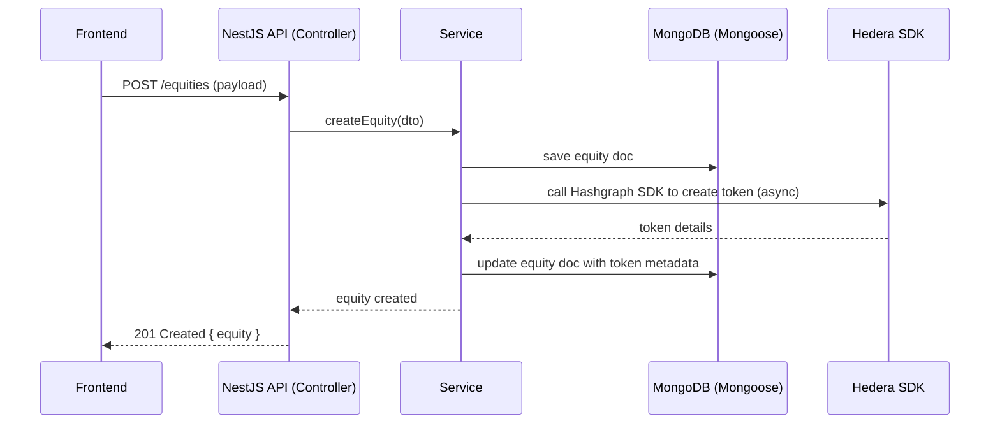

# Technical Specifications

## Overview

This repository implements the NBX backend API using NestJS (TypeScript) and Mongoose for persistence. It exposes domain modules for companies, equities, bonds, users, and uploads. It integrates with Hedera/Hashgraph SDKs for tokenization-related flows and uses JWT for request authorization.

This document describes the architecture, module responsibilities, data model patterns, data flow, contracts (inputs/outputs), error modes, security, testing, and quality gates.

---

## High-level architecture

- Framework: NestJS (modules, controllers, services, DI)
- DB: MongoDB via Mongoose (schemas defined in `*.schema.ts` files)
- Auth: JWT guard (`src/auth/jwt-auth.guard.ts`) protecting authenticated routes
- External integration: Hashgraph SDKs (`@hashgraph/asset-tokenization-sdk`, `@hashgraph/sdk`) for blockchain-related operations
- Config: `ConfigModule` and `ConfigService` used to read environment variables (e.g., `DATABASE_URL`, `PORT`)

### Mermaid: component view

```mermaid
graph LR
  A[Frontend Client] -->|HTTP| B[NestJS API]
  B --> C[Controllers]
  C --> D[Services]
  D --> E[Mongoose Models (MongoDB)]
  D --> F[Hashgraph SDKs]
  B --> G[ConfigModule]
  subgraph Nest
    B
    C
    D
  end
  E ---|persistence| DB[(MongoDB)]
  F ---|blockchain| H[Hedera Network]
```

---

## Module responsibilities (observed patterns)

- AppModule (`src/app.module.ts`)
  - Composition root: registers global modules such as `ConfigModule` and `MongooseModule.forRootAsync()`.
- Companies module (`src/companies/`)
  - `companies.controller.ts`: HTTP endpoints for company CRUD and listing.
  - `companies.service.ts`: Business logic, Mongoose model access (`company.schema.ts`), validation and DTO mapping.
  - DTOs in `dto/`: `create-company.dto.ts`, `update-company.dto.ts`.
- Equities module (`src/equities/`)
  - Handles equity issuance/listing. Uses `equity.schema.ts` and DTOs under `dto/`.
  - May interact with Hashgraph SDK for token issuance.
- Bonds module (`src/bonds/`)
  - Bond definitions and related endpoints (`bond.schema.ts`, `dto/create-bond.dto.ts`).
- Users module (`src/users/`)
  - `users.controller.ts` and `users.service.ts`: user registration, retrieval, and wallet encryption (`encrypted-wallet.schema.ts`).
  - Likely provides authentication endpoints (login/register) or these could be in a dedicated auth module.
- Uploads (`src/uploads/`) - file upload handling (controller + service), likely uses multipart/form-data.

---

## Data model & storage patterns

- Schemas are defined in `*.schema.ts` files and exported as classes + `Schema` objects. The application uses `MongooseModule.forFeature([{ name: X.name, schema: XSchema }])` in module files.
- DTOs sit next to modules inside `dto/` folders; validation likely uses class-validator and Nest's ValidationPipe (project follows Nest patterns).
- Sensitive user wallet material is stored in `encrypted-wallet.schema.ts` and should be encrypted at rest.

---

## Request flow (typical)

1. HTTP request hits a Controller (`src/<module>/<module>.controller.ts`).
2. Controller validates input using DTOs, then delegates to the Service.
3. Service contains business logic, interacts with Mongoose models and/or Hashgraph SDKs.
4. Service returns a result or throws an HttpException; Controller shapes the final response.

### Mermaid: sequence flow (example for creating an equity)



---

## Contracts (minimal)

For each endpoint: inputs are validated DTOs; outputs are JSON objects with resource data or error objects. Standard HTTP status codes are used.

Example contract (Create Company):
- Endpoint: POST /companies
- Input: `CreateCompanyDto` (see `src/companies/dto/create-company.dto.ts`)
- Output: 201 Created { id, name, slug, createdAt, ... }
- Errors: 400 (validation), 401 (auth), 409 (duplicate), 500 (server error)

Auth: endpoints that modify data (POST/PUT/DELETE) should require a JWT Bearer token. Read endpoints (GET list/GET by id) may be public depending on implementation.

---

## Security and sensitive data handling

- JWTs: use `Authorization: Bearer <token>` header. Token verification guarded by `src/auth/jwt-auth.guard.ts`.
- Encrypted wallets: store only encrypted wallet blobs in `encrypted-wallet.schema.ts`.
- Environment secrets: `DATABASE_URL`, any Hashgraph credentials, and JWT secret are read from environment variables via `ConfigService`.
- Ensure HTTPS is used in production and do not transmit private keys over plain channels.

---

## Error handling and logging

- Follow Nest idioms: throw `HttpException` for expected errors. Use consistent error response shapes: { statusCode, message, error }.
- For external integration errors (Hashgraph), capture and map to 502/503 with a clear audit log.

---

## Edge cases and suggested handling

- Missing environment variables: App should fail fast with a clear message when critical env vars (DATABASE_URL, JWT_SECRET, Hashgraph creds) are missing.
- Partial blockchain failures: implement compensating actions or idempotency to reconcile DB state with tokenization status.
- Large uploads: enforce size limits on `uploads` endpoints and stream to storage rather than buffering fully in memory.
- Concurrency: use optimistic updates for state changes tied to blockchain operations (e.g., token metadata updates).

---

## Tests and quality gates

- Unit tests: services and controllers should have unit tests under `src/*.spec.ts` (project already contains spec files).
- E2E tests: use `test/app.e2e-spec.ts` with a test DB or mock for Mongoose; sample config available in `test/jest-e2e.json`.
- Lint & format: `npm run lint` and `npm run format`.

Quality gates (recommended):
- Build: `npm run build` (TypeScript compile)
- Lint: `npm run lint`
- Unit tests: `npm run test` (fast)
- E2E tests: `npm run test:e2e` (against test DB)

---

## Running locally (developer notes)

- Install: `npm install`
- Dev watch: `npm run start:dev`
- Build: `npm run build`
- Tests: `npm run test` and `npm run test:e2e`

Ensure `DATABASE_URL` is provided (or run MongoDB locally) and any required Hashgraph credentials are set as environment variables.

---

## Recommended next-step improvements (small, low-risk)

- Add OpenAPI (Swagger) module for automatic API docs (`@nestjs/swagger`).
- Add explicit endpoint contract docs (or generate from DTOs) to keep frontend/dev docs in sync.
- Add retry/backoff for Hashgraph calls and a reconciliation worker that fixes partial failures.
- Add automated CI pipeline (GitHub Actions) to run build, lint, and tests on PRs.

---

## Files referenced (where to look quickly)

- `src/app.module.ts` (composition root)
- `src/main.ts` (bootstrap)
- `src/companies/` (company endpoints and schema)
- `src/equities/` (equity schema and service)
- `src/bonds/` (bond schema and endpoints)
- `src/users/` (users and encrypted wallets)
- `src/auth/jwt-auth.guard.ts` (JWT guard)


---

## Summary

This application is a modular NestJS backend that uses Mongoose for persistence and integrates with Hashgraph for tokenization. The modules follow Nest's controller-service-schema pattern. The two markdown files created alongside this doc will provide a ready-to-share technical spec plus a frontend integration guide.
